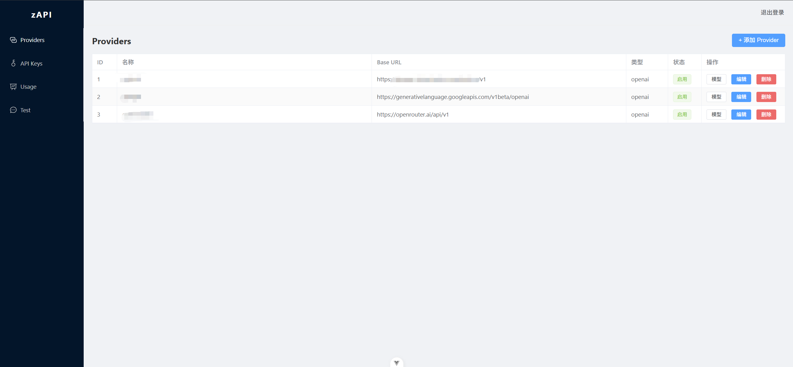
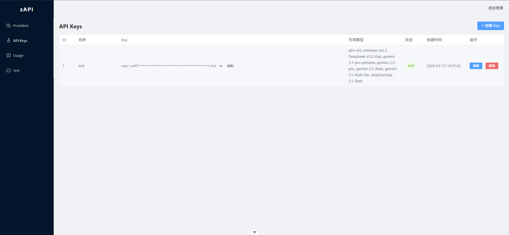
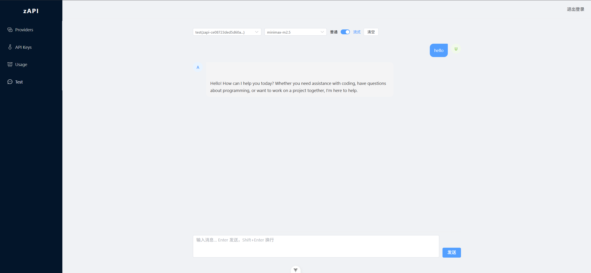
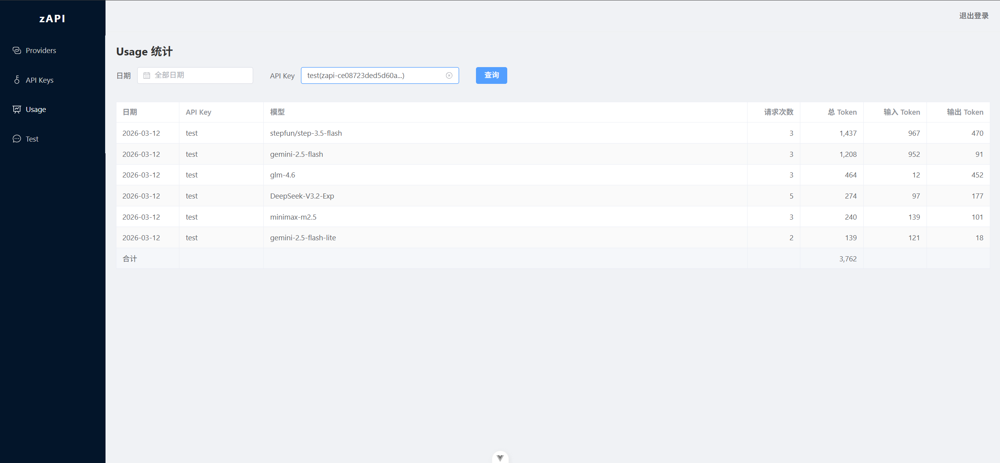

# zAPI

AI API 聚合网关，将多个 LLM 提供商聚合为统一的 OpenAI / Anthropic 兼容接口。

## 功能特性

- **多 Provider 聚合**：Groq、Google AI Studio（Gemini）、OpenRouter、Together AI、Mistral、硅基流动、阿里云百炼、智谱 AI 等
- **双接口兼容**：同时兼容 OpenAI Chat API 和 Anthropic Messages API
- **格式自动转换**：Anthropic ↔ OpenAI 请求/响应透明互转
- **访问控制**：API Key 级别的模型访问权限控制
- **用量统计**：按 Key / 模型 / 日期聚合 Token 消耗
- **模型 ID 映射**：对外暴露自定义名称，实际转发上游模型 ID
- **流式支持**：OpenAI 和 Anthropic 流式响应均支持，并提取 usage
- **管理后台**：Provider、模型、API Key 完整 CRUD，内置对话测试

## 截图

### Providers 管理


### API Keys 管理


### 对话测试


### 用量统计


## 技术栈

| 层次 | 技术 |
|------|------|
| 后端 | Go 1.24、Gin、GORM + SQLite |
| 前端 | Vue 3 + TypeScript、Element Plus、Vite |

## 部署（Docker）

### 前置条件

- Docker 20.10+
- Docker Compose v2

### 步骤

```bash
# 1. 克隆仓库
git clone https://github.com/zCyberSecurity/zapi.git
cd zapi

# 2. 配置环境变量
cp .env.example .env
# 编辑 .env，至少修改 ADMIN_TOKEN
vi .env

# 3. 构建并启动
docker compose up -d --build

# 4. 查看运行状态
docker compose ps
docker compose logs -f
```

启动后访问 `http://服务器IP`，使用 `.env` 中设置的 `ADMIN_TOKEN` 登录管理后台。

### 环境变量（.env）

```env
ADMIN_TOKEN=your-secret-token   # 管理后台登录凭证（必改）
PORT=80                         # 对外暴露端口，默认 80
```

### 数据持久化

数据库存储在 Docker volume `zapi-data` 中，容器重启不丢失。

```bash
# 备份数据库
docker compose cp backend:/data/zapi.db ./zapi.db.bak
```

### 常用命令

```bash
# 停止
docker compose down

# 重启
docker compose restart

# 更新部署
git pull
docker compose up -d --build
```

## 本地开发

### 后端

```bash
# 开发启动（默认监听 :8080，Admin Token: change-me）
go run ./cmd/server

# 自定义配置
ADMIN_TOKEN=your-secret DB_PATH=zapi.db ADDR=:8080 go run ./cmd/server

# 生产构建
go build -o zapi ./cmd/server
```

### 前端

```bash
cd frontend
npm install
npm run dev      # 开发服务器 http://localhost:5173
npm run build    # 生产构建
```

前端默认将 `/admin` 和 `/v1` 代理到 `localhost:8080`。

## 环境变量

| 变量 | 默认值 | 说明 |
|------|--------|------|
| `ADDR` | `:8080` | 监听地址 |
| `DB_PATH` | `zapi.db` | SQLite 数据库路径 |
| `ADMIN_TOKEN` | `change-me` | 管理后台认证 Token |

> 生产环境请务必修改 `ADMIN_TOKEN`。

## API 端点

### 消费者接口（Bearer = API Key）

| 方法 | 路径 | 说明 |
|------|------|------|
| POST | `/v1/chat/completions` | OpenAI 兼容聊天接口 |
| GET | `/v1/models` | 列出可用模型 |
| POST | `/v1/messages` | Anthropic 兼容消息接口 |

### 管理接口（Bearer = ADMIN_TOKEN）

| 方法 | 路径 | 说明 |
|------|------|------|
| GET/POST | `/admin/providers` | Provider 列表 / 创建 |
| PUT/DELETE | `/admin/providers/:id` | 更新 / 删除 |
| GET/POST | `/admin/providers/:id/models` | 模型列表 / 添加 |
| PUT/DELETE | `/admin/models/:id` | 更新 / 删除模型 |
| GET/POST | `/admin/keys` | API Key 列表 / 创建 |
| PUT/DELETE | `/admin/keys/:id` | 更新 / 删除 Key |
| GET | `/admin/usage` | 用量查询（`?date=&key_id=`）|

## 请求流程

```
客户端
  │  Bearer: <API Key>
  ↓
middleware/auth.go      ← 验证 API Key
  ↓
handler/openai.go       ← POST /v1/chat/completions
handler/anthropic.go    ← POST /v1/messages
  ↓
proxy/proxy.go          ← FindProvider（按 model_id 查找启用的 Provider）
  ↓
proxy/anthropic.go      ← 格式转换（Anthropic ↔ OpenAI，按需）
  ↓
上游 LLM API            ← Bearer: <Provider API Key>
  ↓
ExtractUsage            ← 提取 Token 用量
  ↓
recordUsage             ← 写入 usage_logs（聚合）
```

## Provider 配置说明

在管理后台添加 Provider 时：

| 字段 | 说明 |
|------|------|
| Base URL | 上游 API 地址，需包含 `/v1`（如 `https://api.groq.com/openai/v1`） |
| API Type | `openai`（默认）或 `anthropic`（原生 Anthropic，直接透传） |

### 常用 Provider Base URL

| Provider | Base URL |
|----------|----------|
| OpenAI | `https://api.openai.com/v1` |
| Anthropic | `https://api.anthropic.com/v1` |
| Google AI Studio (Gemini) | `https://generativelanguage.googleapis.com/v1beta/openai` |
| Groq | `https://api.groq.com/openai/v1` |
| OpenRouter | `https://openrouter.ai/api/v1` |
| 硅基流动 | `https://api.siliconflow.cn/v1` |
| 阿里云百炼 | `https://dashscope.aliyuncs.com/compatible-mode/v1` |
| 智谱 AI | `https://open.bigmodel.cn/api/paas/v4` |
| Together AI | `https://api.together.xyz/v1` |
| Mistral | `https://api.mistral.ai/v1` |

## 模型 ID 映射

每个 Provider 下的模型支持两个 ID：

- `model_id`：对外暴露的名称（客户端传此值）
- `provider_model_id`：实际发给上游的名称（留空则与 model_id 相同）

示例：对外暴露 `claude-3-5-sonnet`，实际转发 `claude-3-5-sonnet-20241022`。

## 用量统计

- 按 `api_key_id + model + date` 聚合，每天每个模型一条记录
- 非流式请求：从响应体解析 `usage` 字段
- 流式请求：自动注入 `stream_options: {include_usage: true}`，从最后一个 SSE chunk 提取

## 数据库

使用 SQLite，启动时自动 migrate，表结构：

- `providers` — Provider 配置
- `provider_models` — 模型配置（软删除）
- `api_keys` — 消费者 Key（软删除）
- `usage_logs` — Token 用量记录
